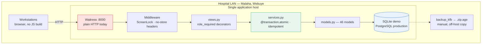
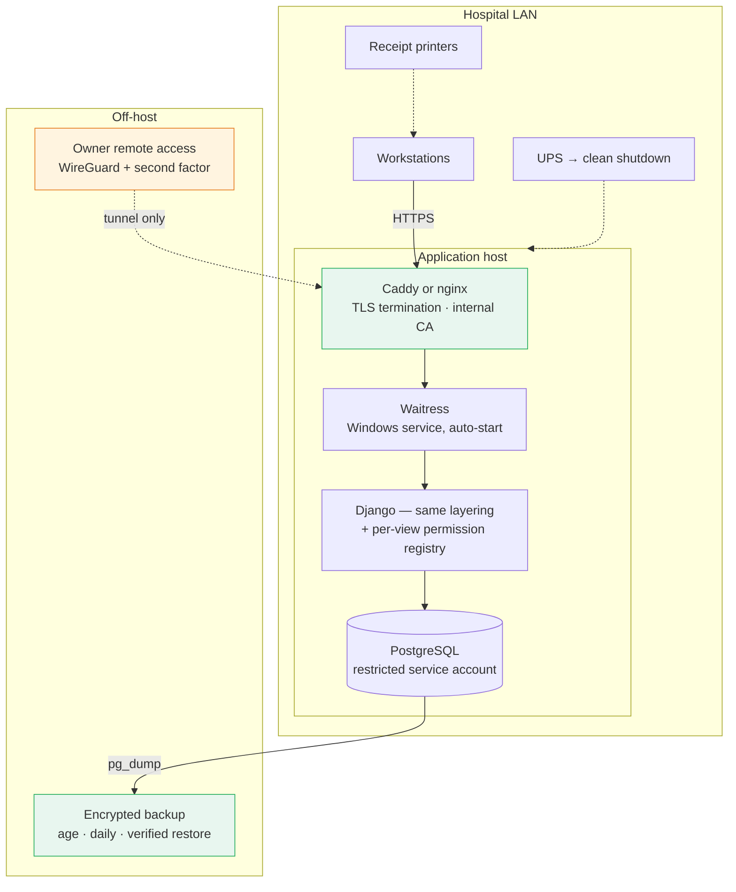

# KFB HMS — engineering audit

Date: 18 September 2026
Scope: full repository at `MadScie254/KFB_HMS`, working tree on `hp-omenx`
Method: every source file read; defects reproduced by executing the code, not by inspection alone

---

## 1. Summary

KFB HMS is a Django 5.2 server-rendered monolith of roughly 2,000 statements across 46 models, two migrations and one application package. It was built deliberately for a single hospital on a single LAN host, and its documentation refuses to claim what it has not built — `PRODUCTION_PREREQUISITES.md` declines to fake M-PESA settlement, declines to assert SHA or NHIF conformance, and blocks a production backup that has no encryption recipient. That restraint is the most valuable property this codebase has. An audit that recommended replacing it with a multi-tenant microservice estate would be trading a system that tells the truth for one that performs modernity.

The real problem is narrower and more serious. Seven defects survive in the paths the hospital would rely on daily, and three of them contradict a row marked **Working** in `IMPLEMENTATION_STATUS.md`. The lock screen does nothing at all. A single pharmacy order can dispense more stock than the hospital holds. The audit trail, described as append-only, can be rewritten with one ORM call.

All seven were reproduced by running the code. All seven are now fixed, with regression tests that fail against the previous commit. The suite went from 15 tests to 26; `views.py` coverage from 39% to 49%.

What remains is not a rewrite. It is a queue of honest work, ordered in §7.

---

## 2. What exists

| Layer | Reality |
|---|---|
| Language / framework | Python 3.14 (3.11 also runs clean), Django 5.2.17 |
| Architecture | Single app monolith: `models.py` → `services.py` → `views.py` → Django templates. No API layer, no client framework, no build step. |
| Data | 46 models, 2 migrations. SQLite for demo; PostgreSQL forced outside demo mode by a scheme check in `settings.database_config()`. UUID primary keys on the money-and-identity models, integer keys elsewhere. |
| Auth | `django.contrib.auth` with a `StaffProfile` carrying one of nine roles. Enforcement is a `role_required` decorator per view. No object-level permissions. |
| Frontend | 33 templates, one 21 KB stylesheet, one 1 KB script. Everything local, nothing fetched from a CDN. Works without JavaScript. |
| Tests | 15 before this pass, 26 after. 73% → 77% total; the honest figure is `views.py`, 39% → 49%. |
| CI/CD | None. No `.github/`, no pipeline, no linter configuration. |
| Deployment | Waitress behind PowerShell scripts, plus `check_readiness`, an encrypted backup command and a restore script. |

The layering is genuinely clean where it exists. Money and stock mutations live in `services.py` behind `@transaction.atomic`, take an explicit `actor`, re-check the actor's role rather than trusting the view decorator, and carry idempotency keys. That is better discipline than most hospital software I have read.

### Design decisions worth keeping

- **Stock is a ledger, not a column.** `StockBatch.quantity_on_hand` sums immutable `StockMovement` rows. There is no editable quantity field to fudge. The cost is a query pattern (§4, C7); the benefit is that theft leaves a trace.
- **Prices are versioned.** `active_price()` resolves a `PriceVersion` by effective date, and a basket with no active price is refused rather than priced at zero.
- **Segregation of duty is in the service layer.** A requester cannot approve their own purchase order; the person who recorded an M-PESA payment cannot verify it. These are enforced in code, not policy documents.
- **M-PESA is honestly unverified.** A manually keyed reference carries `verification_status="unverified"` and raises an exception record. The owner dashboard reports verified and unverified collections on separate lines. Almost every Kenyan HMS I have seen conflates them.

---

## 3. Where the documentation overclaims

Three rows in `IMPLEMENTATION_STATUS.md` assert behaviour the code did not have.

| Documented claim | What the code did |
|---|---|
| "session expiry, lock screen" — *Working core* | The lock screen set a timestamp and changed nothing. A locked user reached every clinical URL. |
| "no negative stock" — *Working primary flows* | One order dispensed 120 units from a 100-unit batch, leaving a balance of −20. |
| "Purchase and credit-note service rules reject self-approval. Purchase approval UI is included." | Accurate on purchasing. `approve_credit_note()` has no view and no URL — it is reachable only from a shell. |

Beyond those three, `verify_mpesa()` and `complete_eye_case()` are likewise unreachable from the interface. Both are tested, both work, and neither has a button. A reviewer therefore cannot verify an M-PESA payment through the application, which means the unverified-collections figure on the owner dashboard can only ever grow.

`ClinicalAttachment` is a third case of the same kind: the model and migration exist, `MEDIA_ROOT` is configured, and no view uploads a file while no URL serves one. Were serving added carelessly through `static()`, every scan and consent form would become readable without authentication. The absence is safer than a naive addition would be, and the gap should be closed with an authenticated view, never with `django.conf.urls.static`.

I would rather see these rows marked *Modelled, no interface* than *Working core*. The honesty of this repository is its distinguishing feature; three optimistic rows cost more here than they would elsewhere.

---

## 4. Confirmed defects

Severity reflects consequence in a working hospital, not difficulty. Every entry was reproduced by execution; the evidence column quotes the observed result.

### 🔴 C1 — The lock screen never locked anything

`ScreenLockMiddleware.__call__` tested `request.resolver_match` before Django had resolved the URL, so the attribute was always `None` and the guard fell through on every request. The companion decorator `unlocked_required` was applied to zero views.

**Evidence:** a locked clinician requesting `/queue/` received `200` with the full waiting list.
**Consequence:** the control that lets a nurse step away from a shared ward terminal did not exist. Anyone reaching that keyboard held the previous user's session and identity, and every action they took was attributed to that user in the audit trail.
**Fix:** the check moved to `process_view`, which runs after resolution. The Django admin is exempted to avoid a redirect loop for a superuser. Two regression tests cover lock and unlock.

### 🔴 C2 — One order could dispense stock the hospital did not hold

`dispense_order()` walked the order line by line and, for each line, re-read each batch's ledger balance. Two lines for the same product each saw the untouched balance, so both were allocated against the same units.

**Evidence:** an order of 60 + 60 units against a 100-unit batch dispensed in full; the batch balance settled at **−20**.
**Consequence:** the ledger stops matching the shelf. Every downstream control built on it — reorder levels, the witnessed count variance, the loss investigation — inherits the error, and the discrepancy surfaces as an apparent theft by whoever counts next.
**Fix:** allocation now carries a per-batch reservation map across the whole call, so a second line sees only what the first left. Two tests: one asserting the overdraw is refused and the batch untouched, one asserting a legitimate split across lines still dispenses.

### 🔴 C3 — Urgent patients sorted below routine ones

The queue ordered on the raw `urgency` string. Alphabetically, `routine` precedes `urgent`.

**Evidence:** display order `emergency, routine, urgent`.
**Consequence:** the clinical ordering was wrong for the middle tier, and wrong in the direction that delays care. That `emergency` sorted first was luck of the alphabet, not design. A clinician reading down the list works routine patients ahead of urgent ones, and the interface gives no hint that it is misleading them.
**Fix:** an explicit `Case/When` rank — emergency, urgent, routine — annotated onto the queryset. The test asserts the rendered order.

### 🟠 C4 — The audit trail was not append-only

`AuditEvent.save()` refused to overwrite an existing row. The ORM's bulk paths never call `save()`.

**Evidence:** `AuditEvent.objects.filter(pk=…).update(action="TAMPERED")` succeeded; `.delete()` removed the row.
**Consequence:** the evidential value of the trail rested on nobody writing two lines of Python. For a system whose fraud story depends on attribution, that is a thin guarantee.
**Fix:** a queryset subclass refusing `update()` and `delete()`, plus an instance-level `delete()` guard. This stops accident and casual tampering; it does not stop a determined operator with database credentials, and should not be described as if it did. Database-level protection is 🟠 R4 in the roadmap.

### 🟠 C5 — Unlimited password attempts

Nothing counted failures. Django authenticates in constant work and never rate-limits by default.

**Evidence:** 25 consecutive wrong passwords, zero rejected.
**Consequence:** any workstation on the ward LAN could grind at a clinician account indefinitely, and the hospital would have no record that it happened.
**Fix:** a `LoginAttempt` model, eight failures inside fifteen minutes, HTTP 429 on the ninth. Counts live in the database rather than process memory, so restarting the service does not clear a lockout and the owner can review attempts. A successful sign-in clears the counter. A locked username stays locked even when the correct password arrives — the test asserts this, because a lockout that a correct password bypasses is not a lockout.

### 🟠 C6 — Patient search could not find a national ID

`patient_list` searched patient number, both names and phone. `id_number` was stored but never queried.

**Evidence:** searching the exact stored value `12345678` returned nothing.
**Consequence:** reception holds the patient's ID card, types the number, gets no result, and registers a duplicate. Duplicate records split a patient's history in a system whose clinical value rests on that history being longitudinal.
**Fix:** `id_number` (exact) and `guardian_phone` (partial) added to the search, with a database index on `id_number`. The result set is now paginated at 50 rather than silently truncated at 100 — the old behaviour showed a receptionist the first hundred matches with no indication that more existed.

### 🟡 C7 — Query counts grew with the ledger

Reading `quantity_on_hand` or `Invoice.balance` in a loop or template issues one aggregate per row.

**Evidence:** the owner dashboard executed **131 queries** for 31 batches and 20 invoices. The `low_stock` list that caused 31 of them is computed in the view and never rendered by `dashboard.html`.
**Consequence:** on SQLite over a LAN this degrades steadily through the first year and is then blamed on the hardware.
**Fix:** `batches_with_balance()` annotates the ledger sum in one query; `invoiced_total()` and `outstanding_receivables()` reduce the receivables calculation to three aggregates regardless of ledger size. The stock movement list now spans `entered_by__staff_profile`, which the template reads per row. The tests assert the count does not change between a small and a large fixture, which is the property worth protecting — a fixed ceiling would only be re-tuned the first time it failed.

### 🟡 C8 — Backups copied a live SQLite file

`backup_kfb` closed the connection and ran `shutil.copy2`.

**Consequence:** closing one connection does not stop the other Waitress threads. The copy could capture a torn page set, and it omitted the `-wal` sidecar entirely, dropping transactions that had committed. A backup that restores to a corrupt or stale database is worse than none, because it is trusted.
**Fix:** `VACUUM INTO`, which takes a consistent snapshot through SQLite itself.

### Open, not fixed in this pass

| | Finding | Note |
|---|---|---|
| 🟠 | `start-server.ps1` binds `0.0.0.0:8000` in plain HTTP, and `KFB_SECURE_SSL_REDIRECT` defaults to `0` | The documentation assigns TLS to the local implementer, which is reasonable. The shipped script still makes unencrypted-on-every-interface the path of least resistance. Patient data crosses the ward LAN in clear text until someone intervenes. |
| 🟠 | `/admin/` exposes 46 models to any superuser | `user_role()` maps `is_superuser` to `OWNER`, so a superuser bypasses every role decorator and edits clinical records through generic admin forms with no service-layer validation. Restrict the admin to configuration models, or disable it outside demo. |
| 🟠 | `ClinicalNote` version numbers are computed then written | Two browser tabs can compute the same `version` and collide on `unique_note_version`. The user sees a 500. Needs `select_for_update` or a retry. |
| 🟡 | Clinicians can release results they requested | `service_order_update` admits `Role.CLINICIAN` alongside `Role.LAB`, and the requester is not excluded, which weakens the "authorised result release" claim. |
| 🟡 | Prescriptions and purchase orders hold exactly one line | `PrescriptionForm` and `PurchaseOrderForm` are single-product. A three-drug prescription needs three prescriptions. Documented as incomplete; it is the largest day-to-day friction in the clinical path. |
| 🟡 | `patient_detail` writes an audit row on every page view | Correct for access logging, but unthrottled: a clinician scrolling a chart generates rows faster than anyone will read them. Consider collapsing repeat views inside a window. |
| 🟢 | `app.js` disables the submit button inside the `submit` handler | Browsers capture the submitter before the handler runs, so `name="action" value="sign"` survives today. It is a fragile pattern to rest a signing action on. Disable on the next tick instead. |

---

## 5. Security posture

Against the OWASP Top 10, measured as the application stands after this pass:

| | Status |
|---|---|
| A01 Broken access control | Role decorators are applied consistently and tested. Two gaps: the admin bypass, and result release by the requester. No object-level checks — any clinician opens any chart, which is defensible in a hospital this size but should be a recorded decision, not an accident. |
| A02 Cryptographic failures | Passwords use Django's hasher. `id_number` — a Kenyan national ID — is stored in plain text and now indexed. Transport is plain HTTP until an implementer configures otherwise. |
| A03 Injection | Clean. The ORM is used throughout; the one raw cursor is a literal `SELECT 1`. Templates autoescape. |
| A04 Insecure design | Strong. Idempotency keys, segregation of duty, immutable ledgers, versioned prices. This is the codebase's best dimension. |
| A05 Misconfiguration | `DEBUG` defaults on in demo. `check_readiness` covers the production toggles well. The admin surface is the outstanding item. |
| A07 Auth failures | Throttling added (C5). No second factor; `StaffProfile.second_factor_required` is a field nothing reads. |
| A08 Integrity failures | `requirements.lock` pins versions but carries no hashes. No dependency scanning. |
| A09 Logging failures | The audit model is thorough. Nothing alerts, and nothing reviews — `AuditEvent` has no interface outside the Django admin. |

**Kenya Data Protection Act 2019.** The architecture suits it: data stays in the building, access is role-scoped, and processing is logged. Three obligations are unmet in code. There is no retention or deletion mechanism — `on_delete=PROTECT` everywhere means a subject-erasure request has no technical answer. There is no export for a data-access request. And the national ID sits unencrypted beside the clinical record; column-level encryption would cost little here, since the field is only ever read by exact match.

---

## 6. Architecture

### Current

### Target

The brief proposed microservices, Kubernetes, Redis, Elasticsearch, schema-per-tenant PostgreSQL and a React client. I am not recommending it, and the reason is the deployment, not the ambition.

This system runs on one machine, in a building where the power fails and the internet is not assumed. Every component in that list adds a process that can fail independently, on a host with no platform team to notice. Elasticsearch for record search, at a hospital whose patient table will not reach a million rows this decade, buys a second data store to keep consistent and a second thing to restore after a power cut. A React client replaces a page that works on a ten-year-old browser with a bundle that needs a build pipeline nobody in Webuye can run. Kubernetes on a single node is a control plane guarding one pod.

The correct target keeps the shape and hardens the edges:

Four changes, each removing a named risk: TLS at the edge so ward traffic is encrypted; PostgreSQL under a restricted account so a compromise is bounded; verified off-host backups so a stolen or drowned server is survivable; a tunnel with a second factor so the owner's remote access is not a hole in the firewall.

**Offline-first and PWA.** Worth separating from the brief's framing. This application already degrades correctly: it is server-rendered, so a workstation that loses the LAN sees a browser error rather than a corrupted local state, and the numbered downtime forms exist for exactly that case. A service worker that queued clinical writes offline would introduce a merge problem — two nurses charting the same patient on two disconnected tablets — that no amount of client code resolves safely. The paper fallback is the better design for this hospital, and the repository already ships it.

**Multi-tenancy.** If Danco Analytics sells this to a second hospital, do not add a `tenant_id` to 46 models. Give each hospital its own database and its own process. At the scale where a second customer is realistic, isolation by deployment is cheaper to operate, impossible to leak across, and lets one hospital run an older version during a pilot. Row-level tenancy earns its complexity somewhere past twenty customers, and a single cross-tenant query bug in a hospital system is an unrecoverable commercial event.

---

## 7. Roadmap

### 🔴 Critical — done in this pass

C1 lock screen · C2 stock overdraw · C3 triage ordering. All three had regression tests added.

### 🟠 High — next sprint

| | Item | Why |
|---|---|---|
| R1 | TLS by default: ship a Caddy config with an internal CA; make the start script refuse plain HTTP outside demo | Patient data is in clear text on the ward LAN today |
| R2 | Restrict `/admin/` to configuration models, or disable it outside demo | It bypasses every role check and every service-layer rule |
| R3 | Build the three missing interfaces: M-PESA verification, credit-note review, eye-case completion | Tested service functions with no button; unverified collections cannot currently be cleared |
| R4 | Database-level audit protection: a PostgreSQL rule or trigger refusing UPDATE and DELETE on `hospital_auditevent` | C4 stops the ORM, not the database |
| R5 | Fix the `ClinicalNote` version race with `select_for_update` | Two tabs produce a 500 mid-consultation |
| R6 | Exclude the requester from releasing their own service order | Completes the segregation-of-duty story |
| R7 | GitHub Actions: `ruff` → `manage.py test` → `check --deploy` on every push | There is no pipeline at all; these fixes can silently regress |

### 🟡 Medium — next month

| | Item |
|---|---|
| R8 | Multi-line prescriptions and purchase orders (Django formsets; the models already support many lines) |
| R9 | Authenticated attachment upload and serving — never via `static()` |
| R10 | Raise `views.py` coverage past 70%; the untested half is where C1, C3, C6 and C7 lived |
| R11 | Retention, deletion and subject-access export for DPA 2019 |
| R12 | Column encryption for `id_number` |
| R13 | Structured JSON logging to file with rotation, so a power cut leaves a readable trail |
| R14 | An audit-review screen for the owner — the trail is thorough and unreadable |
| R15 | Complete the CSV importers: patients, opening stock and opening receivables have templates but no handlers |

### 🟢 Future — once the pilot holds

Second factor for remote owner access (the `second_factor_required` field is already there). Kiswahili interface, which is a real accessibility gain for reception and nursing staff, not a marketing line. Africa's Talking SMS reminders, once the hospital has a sending account and a consent record. MOH 711 county reporting. SHA claim workflows, once the published specification is stable enough to build against. M-PESA Daraja STK Push — last, and only after reconciliation has been proven by hand, because an automated payment path that cannot be reconciled is worse than a manual one that can.

---

## 8. What changed in this pass

| File | Change |
|---|---|
| `hospital/middleware.py` | Lock enforcement moved to `process_view`; admin exempted |
| `hospital/services.py` | Per-batch reservation map in `dispense_order()` |
| `hospital/views.py` | Triage rank; ID-number search; pagination; `batches_with_balance()`, `invoiced_total()`, `outstanding_receivables()`; `ThrottledLoginView` |
| `hospital/models.py` | `AppendOnlyQuerySet` on `AuditEvent`; new `LoginAttempt`; index on `Patient.id_number` |
| `hospital/signals.py` | Failed and successful sign-in receivers |
| `hospital/management/commands/backup_kfb.py` | `VACUUM INTO` in place of a file copy |
| `hospital/migrations/0003_…` | `LoginAttempt` and two indexes |
| `kfb_hms/urls.py` | Throttled login view |
| `templates/` | Lockout notice, pagination, annotated stock balance |
| `hospital/tests.py` | Fixture extracted to a mixin; 11 regression tests added |

Suite: 26 tests, passing. `views.py` coverage 39% → 49%; total 73% → 77%.

Each regression test fails against the previous commit. That is the property that matters: these are not tests written to pass, they are the reproductions that found the defects.

---

## 9. Judgement

I began this audit expecting the usual pattern — an ambitious feature list resting on shallow foundations. That is not what is here. The foundations are the strongest part: the ledger design, the idempotency keys, the segregation of duty, the refusal to claim an integration that does not exist. The defects I found were not in the thinking; they were in the last few inches between a correct design and a correct implementation. A middleware hook chosen one step too early. A loop that re-read a balance it had already spent. A sort on a string that happened to order two of its three values correctly.

That is a reassuring kind of failure, and also a warning. Defects of this shape do not announce themselves. They pass code review, they pass a demonstration, and they surface months later as an unexplained stock variance or a note signed by someone who had walked away from the terminal. The countermeasure is not more architecture. It is the pipeline in R7 and the coverage in R10 — the machinery that re-checks these properties on every push, so the next one is caught in minutes rather than in a loss investigation.

One open question I could not resolve from the code: whether the hospital intends to record NHIF or SHA membership at all. There is no field for it anywhere in the patient model, and `PRODUCTION_PREREQUISITES.md` defers the decision. If the answer is yes, it belongs in the schema before the pilot rather than as a migration against live patient records.
